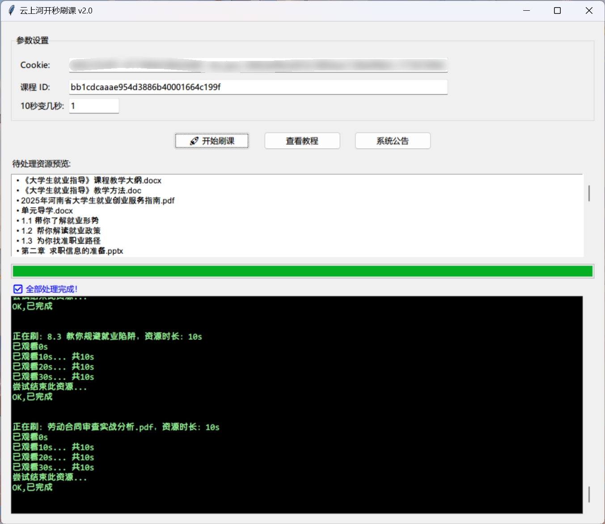

# 云上河开刷课助手(AI学习通)2.0

> 河南开放大学、郑州信息科技职业学院 专属网课速刷工具，Python自主开发，高效完成课程进度

## 项目简介
本工具专为「云上河开AI学习通」平台设计，适配河南开放大学、郑州信息科技职业学院课程体系。采用Python3语言独立开发，无需真实观看视频即可快速完成网课进度，解决网课学习耗时问题，兼顾灵活性与实用性。

## 核心功能
- 秒刷网课：无需手动观看，最快30秒即可完成长达数小时的单个科目
- 速度可调：支持自定义刷课速度，适配不同场景需求
- 资源查询：自动检测并列出账号下未观看的课程资源，精准定位待处理内容
- 专属适配：针对性适配「云上河开AI学习通」平台，兼容目标院校课程结构
- 便捷UI设计

## 使用要求
- 已打包exe，双击即可运行

## 使用说明
暂停

## 注意事项
- 本工具仅用于学习交流，请勿违反学校规章制度及平台用户协议
- 建议合理设置刷课速度，避免过快操作引发平台风控
- 使用前请备份个人学习数据，谨防数据丢失或账号异常
- 开发者不对使用本工具造成的任何风险或损失负责

## 开发信息
- 开发语言：Python
- 开发者：自主开发
- 适配平台：云上河开AI学习通
- 支持院校：河南开放大学、郑州信息科技职业学院

## 免责声明
本项目仅为技术学习与研究目的开发，不承担任何因违规使用导致的法律责任或账号风险。使用者应遵守相关法律法规、学校规定及平台协议，尊重学习本质，合理使用工具。
